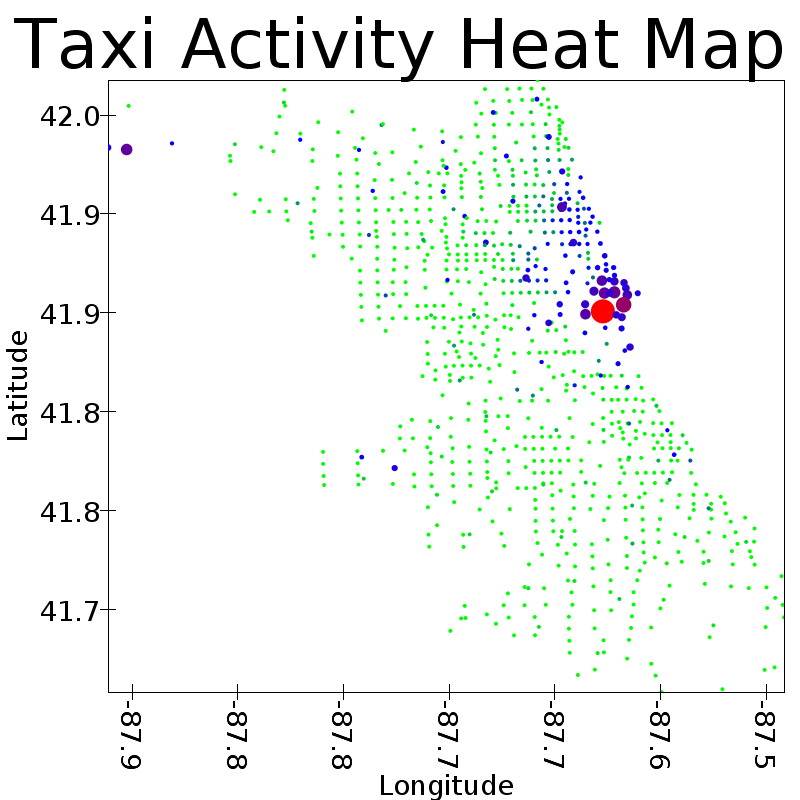

# Chicago Taxi Transportation 
##### Emerson Spradling

I used the the “Taxi Trips” dataset from the City of Chicago which is approximately 72 gigabytes in size. I choose this dataset because I am interested in human decision and patterns as it cannot be scientifically predicted by specific algorithms. Through using machine learning algorithms, I hope to be able to predict human decisions with a high success rate.  In this project on Taxi Data I planned to do just that. Because of the size of data and limited resources, my approach to processing this data was taking a random sample size to work with on a local computer and then scale it to the full dataset using a cluster. Due to this I was able to much more efficiently edit code because, when scaled to the cluster, something as simple as reading in the data required ten minutes. 

The first question I wanted to answer was taxi usage in Chicago. To answer this, I created a heat map of both taxi pick ups and drop offs as shown below. The green represents the lest active areas, blue represents medium activity, and red represents high activity. I also used size to indicate this as well to reinforce the dimension. We see that there is high usage in downtown Chicago, which is to be expected. However, what is interesting to note is that on the outskirts we also see medium activity. I hypothesize that this is due to people taking taxis into downtown Chicago. 

I then applied a K-Means clustering machine learning algorithm to the dataset using Trip Miles, Fare, and Trip Seconds to hopefully find and explanation of the datapoints in the heat map that had high activity but were on the edge of the city. With the clustering algorithm, I was able to cluster with a 83.32% test set accuracy. Through this I found the following results:

|Cluster | Average Trip Seconds|
| ------ |------------------ |
|         1|2286.7081191032207|
|         3| 49258.56083553657|
|         4| 2066.998901271386|
|         2|1871.0490110529377|
|         0| 545.0601430606067|

|prediction|      Average Fare |
|----------|------------------|
|         1| 37.34561981611844|
|         3|30.539928037399537|
|         4| 52.75945063569301|
|         2| 6378.689128853985|
|         0| 9.176503692770524|

|prediction|   Average Trip Miles|
|----------|------------------|
|         1|14.588542916067766|
|         3| 5.575106543168812|
|         4|1513.6440527389736|
|         2| 20.21516579406632|
|         0|1.5392743019672586|

The graph below shows each taxi stop and its cluster with the size being the taxi activity from the previous heat map. The cluster was determined by taking the cluster with the highest count at that point. I used yellow to represent the cluster with the highest amount of points on the map so that the other colors would pop out more. The magenta cluster ended up become the “outlier” cluster where data points were not similar to the rest and therefore why we do not see any on the map. On the map, we can find the points with high activity from the heat map and get statistics about them. The statistics reinforce my hypothesis as Cluster 1 has a “Average Trip Miles” of 14 which is approximately the distance from the points to downtown.

Key:
|Color | Cluster|
|------|--------|
|Yellow|0|
|Green|1|
|Red|2|
|Blue|3|
|Magenta|4|

I also produced another graph to help visualize the key statistics from the clustering shown below where size represent Fare:

After the clustering algorithm, I then ran a Multilayer Perceptron Classifier algorithm on the data using Trip Miles, Trip Seconds, Tips, and Extras as the input decisions in order to predict the Payment Type used to pay for the taxi ride. The different types of payment are listed below:

|Payment Type|
|------------|
|Cash|

